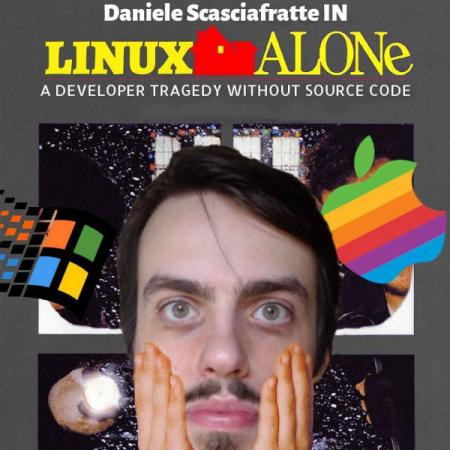

-# My (open source) story

I want to start with a chapter about me to let you understand the rest of the book (or the book itself).  
I also hope to be inspirational and show new ways to approach the technology and open source philosophy.  

## Let's start with the flashback!
I was born in 1990 in Rieti (Latium, Italy), a little city famous because is the `Umbilicus Italiae` (this is Latin and means the belly button of Italy), basically the center of Italy.  
The city is near Rome, Terni and Aquila and apart from the name is famous all over the world for [The Rape of the Sabine Women](https://en.wikipedia.org/wiki/The_Rape_of_the_Sabine_Women). The legend is that when Rome was founded there wasn't sufficient women for the citizen so they kidnapped there/around. This story was famous because many artists during the Renaissance used it as theme for their arts.  

I think we are more famous for the Porchetta (food) and Lucio Battisti (singer who also made stuff in Spanish, English, French and German), and San Francis that moved in Rieti and built various sanctuaries and the first nativity in Greccio.

On 1990, the year of "Home Alone", my grandmother said that as kid I was similar to that child, anyway I think I have grown a little better without thiefs trying to break in my home.  

  

I really like the Open Source world and this has created many problems because I joined many communities, I contributed to different projects, joined many events and sometimes this creates confusion about my role.  
In my personal life I like to collect comics Italian, European and American, I have a large library with many comics in my room.  
My passion about Open Source (or activism) is not clear to my friends because it doesn't revolve around sport (especially soccer that I hate a lot) and in Italy it seems that if you aren't interested in following sports (or practicing them) you are like a loser. Anyway this create issues with my friends that doesn't know what I do for living or why I travel a lot.

This is probably the first reason why I am so easy to get involved, because what I do in Open Source has a real effect on the world and people, compared to this kind of interest that for me is not productive.  

I attended the “Liceo Scientifico Tecnologico” (in Italy the school differs from the others, we have different schools based on the topics), completed in 2009 at "ITI Celestino Rosatelli" in Rieti with 68/100 as a final score of 5 years (thanks to the math that lowered my score), I did a little thesis (it's quite common in Italy for the final exam in high school) and I was only one in a class of 27 people, I even took the laptop (purchased in 2006) for a demo on Lissajouss graphs on Windows XP virtualized on Sidux (the Linux distribution based on Debian Sid, that is now dead).  
I started to use Linux on my personal laptop just before the end of the school but I was distributing my dev projects online (with sources already).  
I started to develop in 2006, just before starting the third year of high school, where we finally should start to develop with Visual Basic 6. The school switched to more new technologies like Windows XP (we were using Windows 98) and .NET framework (was using that already).
I was very thrilled from starting to develop that in the year 2006, I was already doing my first internet websites with HTML4. At the time my data source was the local public library and the IT magazines.  

  

My very first website was about the Dragon Ball anime that I maintained until 2009 and this allowed me to learn and discover the web development after the desktop development.  
Meanwhile if I wanted to use internet I had to be good at school (you know get good votes). In the house we had ADSL that was hour based for the price, so I usually got 1 or 2 hours at week. In other words I had a paper with me every day with the list of stuff to check or download that I filled every week to use internet.  
Something incredible compared with today!  

I remember when my father got frightened because I was taking part online in forums or by chat (MSN or IRC) with people that I had never met. I started in this period to use my nickname `Mte90`, created in 2002/2003 and still using it. That is why people meeting me at events think my name is Matteo.  

Anyway I was developing my software during the school times, based on my needs, this is the first reason I think everyone needs to start from a personal need, to get motivation for everything.  
I am still using this approach when I need to learn something new, I don't study because someone told me, but because I need it. A different approach to school, work and life that helps you optimize but also stay motivated, because after all there is a real reason.  
So to explain what I am doing or what I am learning to others, because what's useful for me may be also for others. That even before discovering the open source world.  

  

For me internet was the first way to meet people like me (I still love forums) to work on my projects or discuss.  
In 2009 after the school I had to choose what to do with my life. A question that all the young people often face, my choice was very simple: work with computers (without math).   
Something clearly impossible at that time, it was a like an elitarian job, because there was this idea that to be good at computer you needed to be good at math i.e. on remembering formulas or calculating algorithms.  

I chose to go to L'Aquila and take a university course at the Academy of Fine Arts on Web Design. After all I liked to work with websites, so I was easily getting the piece of paper (my parents were longing for).  
For non-italians, 2009 was the year of the big earthquake with 309 dead and that course never started, so I took a sabbatical year working at the family's shop in the morning and doing a work stage in an IT company in the afternoon for 6 months.  
My tasks were to install antennas for internet, configure web servers, install or fix computers; while at the shop I was learning how to talk with customers and how does a company works, at only 19 years old.  

I> 2010 was the last year I developed on Windows when I did that work phase, where I valued Linux a lot more.  

Finished this year (later I worked only at the family's shop) in the position to gain the this piece of paper, that as of today is useless. I removed the reference on Linkedin and I don't want to mention the school or the course I attended for years about web/digital stuff in Rome (basically only Adobe-boring stuff).  

  

So in the 2012, when people started to call me "Linux" I started working as a freelance.
Up to 2015 where I founded a Web Agency in Rome with two friends and as of today we are still doing open source development and web sites/application development.  
In our company statute is written that we have to use 50% of our time on contributing to open source technologies (a big idea of Eugenio).  
After 4 years we are still doing stuff but we are only two people now. With a lot of other topics to discuss in next chapters, I hope I am not being boring (hate that) and to be able to show you the key points informing my interest in this industry.  

## How I started to contribute to open source projects

I was developing in PHP because when I moved to Linux this was my home, with the discovery of Python and I made my first UI projects with the Qt framework. I was experimenting with doing the same things on Linux as I was doing with Windows, even with custom software.  
It's basically what people do when migrating from the first to the latter, in my case I felt like Indiana Jones, without boundaries, and it was intriguing.  

At 18 years (2008) I bought my domain `mte90.net`, after some time I opted for using a CMS, and since databases were overrated I decided to build my site with a flat CMS.  
So I started using an Italian Open Source CMS and extending it creating plugins and also doing a fork to the project to add more stuff.  
I built a tiny community around it, a mini build system and at the time I didn't know about git or other version control systems.  
In 2012 I opted to use a real CMS that was following real coding standards (compared to the spaghetti code) to do more and better without starting from scratch.  

  

There was a world outside that was doing many things and available but most important they were working, and they were using a database.  
In few words I discovered WordPress and with that I started freelancing, contributing to the projects and communities online (where I will find my colleagues), writing technical articles (in Italian mainly).  
I also coded my first software for someone else (my father), today we call it a `bash script`. 

T> Bash is a scripting language on Unix systems (OSX and Linux) that lets you automate software interaction.

At the time I migrated all the computers in the family store to Linux and had a simple request to speed up the flow. Put some sheets on the scanner and automatically prepare Thunderbird and the image scanned on a new e-mail, so in 2012 I [coded](https://daniele.tech/2012/08/kde-scantoemail/) a solution for this need, and it's still in use today in the shop.  
I discovered that my English was a huge mess (today I speak only "Italish") so I resolved to improve it by studying it again, to be able to cooperate with the international side of open source projects. Submitting code, ticket reporting, discussion and proposals for let's say Mozilla or WordPress, this learning step was needed.
Other communities I was contributing to at the time were KDE, Sidux/Aptosid/Siduction (my Linux distro) and many others.

## Why everything started with a Linux Day

Hour: zulu 16:00 (to read as sixteen zero zero) in 22 October 2013  

  

Me with my 2nd laptop with "few" stickers (also wearing my flowing hairs) starting to do [my first talk (Italian report)](https://daniele.tech/2013/10/firefoxos-utenti-sviluppatori-roma2lug-linuxday-2013/) at 23 years old.   
I joined in the January of the same year a ["Firefox OS App Days" (Italian report)](https://daniele.tech/2013/01/firefoxosappdays-a-roma-io-cero/) that was my first hackathon, and I won the first device with Firefox OS produced.  
I never joined a Linux Day (in Italy is a yearly event usually organized in 80-90 cities in the last Saturday of October in the country about Open Source) but I had always wanted to go to discover and learn new things, instead of using only internet.  

I did my first talk with a bit of anxiety because it was in an university, with people younger than me, but with this talk I joined the Mozilla Italia community.  
Joining an event like this opened my eyes on the IT industry, because more people are interested in these things also attending in live, I wasn't alone.  
This event was the first step to improve because I could discuss things with others and compare myself by talking with people to get feedback.  
And, why not, have fun and network with people, that nowadays are the 2 most important parts of my role as a contributor.  
For people appointed to organize community activities and events it's very important to have very good networking skills to be able to involve more people and engage them through better promotion and communication.

## Mozilla, my house

Since 2013 Mozilla allowed me to participate in many higher level projects.  
I met people and they supported me (even financially), so I had the chance to understand how large IT companies operate. I learned to host meetings, to manage tasks and proposals and in general many new ways of cooperating in Open Source among many.  
I had an idea of how the browser and software work, their development cycle and localization problems; I learned to work in groups, to assign tasks and to research and deal with technical issues.  

I also discovered what doesn't work at a higher level within IT companies, the distance they have to their users' needs (because they follow market needs instead).  
I strengthened my language skills in the process.  
Mozilla assigned funds to volunteers to organize or participate in events, when I joined I was one of the few experts of Firefox OS in Italy.  
In short, I traveled all around Italy, visiting new places and meeting people, having the chance to better understand the needs and questions of the users of Mozilla products and of the Open Source ecosystem as a whole in general.  
This traveling allowed me to build a group of friends that started to do the same, hosting demonstrations of Firefox OS, explaining how to develop for it, recruiting new people and finding new ways to engage them. Also we have improved and expanded Firefox OS Italian manual together.

  

With the [death of Firefox OS](https://daniele.tech/2015/05/the-firefox-os-1-x2-x-problems/) I got a lot of experience in community building, mentoring, development and so on, and I kept traveling in the country also even if a little less than before.  
I was giving speeches about other technologies, like addons development, Firefox web tools for developers, how to join the community, privacy and why Mozilla was important.  

These travels created an "aura" around me, I was (and still I am) called many nicknames like Mozilla-Man, Mr. Firefox, Mozilla and so on. People aren't creative with nicknames after all...  
At the same time I started improving my English, and in 2015 I joined Mozilla Reps program, participating in activities and discussions online at international level.  

I> Mozilla Reps program is an international program free for everyone meant to empower local Mozilla communities (not only about Firefox but Mozilla per se or other projects like A-Frame as example).  
I> It is a program with ~250 people from a lot of countries now (when I joined it was double that number), empowering volunteers to become better community managers, better project managers, join Mozilla discussions as NDA (Non-Disclosure Agreement) group, get funding for events and swag.

In the same period I attended my first international event the [FOSDEM 2015](https://daniele.tech/2015/02/fosdem-2015-the-report/), even with my messy English I was able to organize it with the help of 3 Italian friends.  
Participating allowed me to meet new volunteers in person (also from Mozilla) and this helped me to meet new people (or recognize them from the nickname), slowly I understood that the Reps program was a way to help the community to do more and better.  

It wasn't the time of Firefox OS anymore but there were other kind of activities to do, the real thing was that I understood better Mozilla issues.  
Mozilla Foundation/Corporation is influenced by mood a lot: they start a new project (startup style), get a lifetime span of few years and later they close to work on something else and abandon everything. Even, if the project was used, important and that following the manifesto.  
One of the most painful things for me was the "Web Literacy" period, when they choose to close the Firefox Student Ambassador program, to start a new one for the students and a new one called Mozilla Club.  

I> Web literacy comprises the skills and competencies needed for reading, writing and participating on the web. It has been described as "both content and activity" – i.e., web users should not just learn about the web but also how to make their own website.  
I> From [https://en.wikipedia.org/wiki/Web_literacy](https://en.wikipedia.org/wiki/Web_literacy)

This program had a very important mission, fight the digital illiteracy. For a country like Italy with a lot of it, with people who don't know how to use a computer while the smartphones was spreading it was very important.   
Mozilla for many things works like a startup (I work/ed with them and I am still not liking that way of doing things), starts a lot of prototypes by needs or interests, that can be privacy (like the Encrypt campaign, when FBI wanted Apple to share the encryption keys And Codemoji), Mozilla Pulse, Maker Party, Mozilla WebMaker, Firefox Test Pilot, Firefox Hello and many others that I probably forgot.  
Also the fact that Mozilla uses a lot of metrics that often are not realistic: like remove features but not understanding that they are important for a lot of users. Removing them maybe is a wrong solution, maybe you didn't promoted very well or that features is used by everyone just once every month. The cool part is when a feature is reimplemented after years in a similar way, not just because the code was ugly and was needing a refactoring but also because the feature is useful and others are doing the same. I wrote an article about how [Firefox lost the browser war](https://daniele.tech/2020/03/firefox-lost-the-browser-war-and-what-we-can-do/).

With employees that not always stay in the company more than 2-3 years, it is difficult to create a connection or partnership since if you have to start from scratch every time, find new references and talk with people that don't know the Mozilla experience/background and the open source philosophy.  
In any (ranting) case today is always a source of discoveries and as volunteer you learn how to manage these issues, basically like how the employees themselves do. How?  
Ignoring them, moving on new stuff with a bit of nostalgia. That way often volunteers hold the only memory of what Mozilla did because they are participating more than the people that worked there.  

An important lesson is in the working environment and human, there are reasons besides the personal human/logical/financial area, things doesn't last forever except Colosseum, Pantheon, Stonehenge, Great Wall of China and Internet Explorer, Python 2 or Perl 5.  
Yes, it is still around there, people are still using it and developers need to support it.  

I want to close this section with links from my blog about a lot of experiences in Mozilla, I had always the habit to write a report after events or topics, and know they are a very valuable resource to understand the period and what was happening years after:

* [September Mozilla Marketplace Contributor of the Month: Daniele Scasciafratte](https://daniele.tech/2014/10/september-mozilla-marketplace-contributor-of-the-month-daniele-scasciafratte/)
* [The Firefox OS 1.x/2.x Problems](https://daniele.tech/2015/05/the-firefox-os-1-x2-x-problems/)
* [Mozilla All Hands London – I was there](https://daniele.tech/2016/06/mozilla-all-hands-london-was-there/)
* [ConfSL 2016 – I was there](https://daniele.tech/2016/06/confsl-2016-was-there/)
* [Mozilla Tech Speaker Meetup & European Gathering in Berlin](https://daniele.tech/2016/09/mozilla-tech-speaker-meetup-european-gathering-in-berlin/)
* [CLSxItaly Roma 2016 – I was there](https://daniele.tech/2016/09/clsxitaly-roma-2016-was-there/)
* [ExtStoreStats – Get stats of your browser extension](https://daniele.tech/2017/01/get-stats-of-your-browser-extension/)
* [Why I am developing Browser Extensions](https://daniele.tech/2017/09/why-developing-browser-extensions/)
* [Analisi del sondaggio Mozilla su IoT per l’Italia](https://daniele.tech/2017/11/analisi-del-sondaggio-mozilla-su-iot/) - Italian

  

I forgot to mention the huge moment of gratification, my name is on a monument with many other volunteers. 

I> This is one of the example of how you can increase the value of what people are doing, a name is a lot of things, often in the projects is easy to limit the gratification to a "Thanks for the reporting" in a ticket but volunteers invest their time so you need to think always on how to engage them.  

## WordPress where my job and passions meet

To live you need the *"pagnotta"* (the food on your table), contributing to Mozilla is very enjoyable but is not enough for it.  
With many years of experience inside Mozilla and at events, I started to freelance with WordPress until opened my agency in 2015 with some friends. Let's do a step back.  
I always developed with PHP and WordPress, like a lot of you may already know, is easy and has a huge community and is possible to learn and make the difference more easily.  
Only the will to do and change things is required, often quite impossible within Mozilla, where volunteers are perhaps the last small part of the chain. Also, there was the programming part available that was opening more opportunities compared to Mozilla.  

I started on a Google+ Italian community, hosting webinars about different topics and as technician I had more details to offer. This way I met my future colleagues, we were all moderators of this community and I started to write articles and doing support.  
I was discovering this other passion after the developing, writing articles that I knew would help others from technician stuff to news. After all I had the sources, what to follow and where to find the information including what was the interesting stuff for the audience.  
In the meantime I was getting trust in the WordPress community, co-organizing the WP Rome meetup and slowly also contributing to WordPress core.  

Think about it, at 25 years old your first patch to WordPress was used by millions of websites around the world, was very exciting. Without considering the localization that opened my eyes in a lot of things I was ignoring.  
Localization is very important for spreading software, improving awareness and helping to promote digital in your country or region.  

So I did a browser extension for [for Firefox/Chrome for localizers](https://daniele.tech/2018/03/2-years-of-glotdict/), contributed to tools for localizers, became a maintainer on how to manage projects and lead projects, participate in the development of other tools and so on.  

  

We cannot mention the many WordCamp in Italy, so I started traveling up and down the country and up to join 3 different meetups in 3 different regions in the same week (and in 2 as a speaker).  
Up to 2018/2019 when I was part of the founder committee of the first WordPress fork, ClassicPress, where I leaded the localization team and part of the core development.  
Compared to Mozilla, in WordPress it is easier to receive rewards for what volunteers do, mainly because you can see your action effective instead of merely promoting other things in which you have no chance of being influential.  

Also the WordPress project has issues on management, like Mozilla, and is something not easy to solve by the volunteers (again like Mozilla). WordPress as project is managed by the big company Automattic, because in the WordPress Foundation has many of their employees in the various teams as leaders, so it's easy to follow the roadmap they want: once again this is my opinion, but the fact is simple enough to confirm, look the keynote of the last WordCamp Europe/US with a roadmap that is not focused on the needs of users or communities but on their business needs.  

Another point that is missing, a clear roadmap and a governance that not start from scratch but from people that already know the open source ecosystem/world. There are a lot of open source foundation to get inspiration, why we need to start from scratch and not achieve anything?  
It's more simple to do that the foundation hire few people as manager of the various area that are not involved with any company and the volunteers that do what is planned and discussed all together.

## Last flashback

Let's talk of [2016 when together with some friends I met online (Italian)](https://daniele.tech/2016/03/industria-italiana-del-software-libero-la-nascita/) (it is easy to see the repetition of similar facts), we founded an association "Industria Italiana del Software Libero".  
Our idea was to bring our great passion towards the work side, creating a group of professionals who use open source software on the professional side and contribute to the same.  
A great idea that today has failed to explode as we thought, also because we are professionals who have to work and it is difficult to move forward.  

I say it because in 2018 I became the president of the association and after a few years I can see the issues in a world that transform itself too much quickly.  

Let's think a moment together, in 2019 the open source world is not as strange and dark as 5 or 10 years before.  
The world is paying more and more attention to the opportunities of these technologies (except the Italian government in the various cities) but I see the big problem: to contribute.  
This book was written because I see a lot of young people and newcomers that ask how to do something, how to start or how it works. Because it is more important to be able to participate and contribute than to be mere users of the product for them.

## Addendum (third edition)

Write a new edition required 2 years with the Covid pandemic that broke the flow of ideas generated during FOSS live events, but I didn't stop gathering resources and doing Open Source.  

On February just few weeks before the Covid I joined an event where I was the reference about the [Open Source topics in the Italian Depute's Chamber](https://daniele.tech/2020/08/etica-open-source-riuso-e-software-libero-versione-originale/).

On December 2020, I started my podcast in Italian about weekly updates from the Open Source world with a bit of cyber security and technology updates with my opinions. As today with more than 90 episodes it was an experiment that worked with more 220 followers (on Spreaker, Funkwhale and Youtube I can get those numbers but not on the other services). Every week I gather an average of 34 links to discuss in less of 30 minutes. I wasn't thinking about all this interest in these topics as it is very specific, but looking on the people who reach me to share feedback or links seems growing.

On January 2021, I was added also on the `about:credits` page in all the Mozilla Products like Firefox, for my contributions in the past years. At same time the "Industria Italiana del Software Libero" association was closed because there was no action from the members on doing the usual things, it was a good experiment on how to manage this kind of things.  

On April 2021, I was elected in the [Italian Linux Society](https://www.ils.org/) Association council and I will be part of this for the next 3 years. I was happy to join it because I wanted to give back to my country after doing international stuff in various communities. As association, we help all the Italian Linux User groups and promoting Open Source in Italy and we did various things in 2021 like [9000 € in donation to FOSS projects](https://www.ils.org/2022/01/01/2021-con-ils.html) or I organized the [Merge-IT](https://merge-it.net/) conference online with over 12 Italian Open Source communities or about Digital Rights to discuss various topics.  
I put my experience like in these ebooks to improve various websites we offer like [Planet.Linux.it](https://planet.linux.it/eventi/) with a new calendar and ICS/RSS feeds divided as national or by regions to find the nearest events to you about open source, so not just LUGs but also from meetup and national communities.  
Or a whole series of tiny/easy guides to contribute to [Open Source projects from your smartphone/computer in 5 minutes](https://www.linux.it/todo/attivita/), not just using an open alternative app.

In April 2022, I joined the Italian community behind [/r/place, and it was an interesting experience](https://daniele.tech/2022/04/the-r-place-story-from-the-italian-view-and-from-bots/) in something that last few days but purely online.

# Conclusion

Open source allowed me to:

* Gain experience despite the fact I never joined university
* Improve English (this book was written half in Italian and half in English and reviewed from other people, thanks!)
* Improve my relationship skills (no one thinks I was a shy guy)
* Improve the public speaking skills
* Understand how to promote stuff
* How to split problems
* How to manage a working group
* Know what is needed to organize an event
* Understand which are the requirements to keep a community alive
* Compare with others and see my limits/problems
* How to ask to... ask and not getting troubles for it
* The various aspects of a project (not only about a software)
* Learn how to develop, the right way
* Learn how to listen and when it is time to shut up
* How to propose stuff

A lot of very useful things for work but also for personal life, the fact is I did everything for... fun!  

X> # Your turn
X> I want you repeat the same flow of thoughts as I did on writing this chapter.  
X> Take 2 analogic tools, a pen and a paper and write on that:
X>
X>  * The first time that you participated in an open source project
X>  * How many years ago
X>  * List all the things you learned and mark the most important lessons of your life
X>
X> If you never joined an open source project:
X>
X> * What do you want to replicate of this story
X> * Where you see yourself in this story
X> * What is your biggest target (also non-realistic)
X> * What is the first step you want to do
X> * What you want to learn

There are also other FOSS story around with less photos but more clear learnings (maybe) like [this one](https://blog.burntsushi.net/foss/).