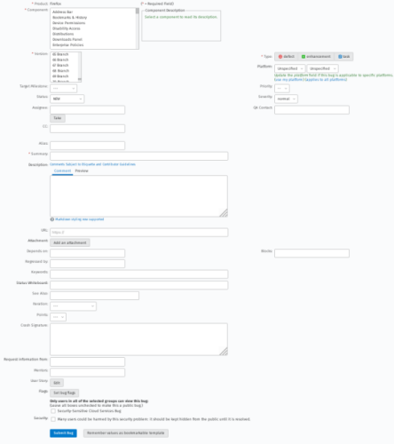
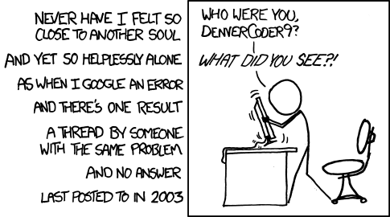
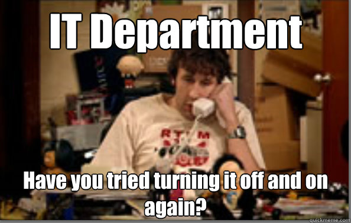

-# Contributor Mode

I call “Contributor Mode” that moment I use to code patches, localize or organize events (no specific key combo here – I grew with videogames).

In other words, when I am highly focused in these activities, doing something I like (oftentimes) and I strive to do it the right way. Usually I enter Contributor Mode to have a break between 2 different job activities, to relax a bit.

This makes distinguishing among work and contribution periods easier. Often these two activities may be on the same level of importance, but I prefer shifting my attitude in performing them, for later I may use the outcome of contribution for a job project.  

Being able to split way of thinking it's very important in understanding the differences, the quality of what you are doing, why you are doing it and also it helps appreciating more what you do.

The contributor, basically, never forgets why he is doing something: A contributor needs a goal to point to as a North Star to be **motivated** to do things, not just for the sake of them, but because of the desired outcome.  
To make the goal - that for a contributor is not earning his lunch - more enticing and motivating, there are different practices to improve the quality of the time spent. Don't forget a contributor is using one of the most valuable currencies (not speaking about blockchains here) *time*.  
This currency needs to be spent wisely, the boring parts of the workflow, or the ones prone to express more issues, need optimizations, it's better to prevent issues where more attention is needed and also an understanding of how to delegate or ask for help is needed.  
Question is how you can move in the Open Source world in a comfortable way, starting by doing something that not only helps the project, but is also enjoyable, interesting and thrilling without abandoning the floor?

Simple! You have to learn to live inside it.

How can you live in an open project without any previous experience in contributing to one?  

Good question, if the answer was simple you probably would be doing something else now, instead of reading this book.  Also don't forget that more is small the project more is easy to contribute to but you should not be afraid to discover how big project works.  
Take a moment, relax, get ready to discover a new approach to community projects that may help you in your work as well as your daily life.  

## How to live inside the Open Source

First step is discovering the **Code of Conduct**, every project has one (often) and usually they are based on the same basic rules, mainly covering how to work on the project and relate to others among the project.  
In detail, common sense rules: not to be aggressive, no bad words or insults, understand contributors come from different backgrounds and it isn't always easy to understand each others or avoiding conflicts without applying patience.

I> Being Italian, for me it's normal to make gestures, even when people aren't seeing me. Other people may be confused by that, or the gestures themselves can mean differently to them. Think about that in a big picture, adapting your tone to the environment.

This Code of Conduct often applies only to the project home and not for interactions with others about the project happening outside the community (sometimes you even have to sign the CoC), so a twitter interaction may violate it!

For Italian people, I usually summarize like follows:

* No bad words
* Don't insult other people (except the ones eating pineapple pizza or drinking cappuccino during a meal)
* No gestures

For Italian people usually those rules are enough to understand how to behave differently, maybe the rule about gestures is drastic but it's a very important one (of course depending on context).

Basically Open Source is a group work with different people so is important to have some basics rules to live and moving on and avoid problems during the discussions that can degenerate on flame war. A reading about [work with people that you don't like can be easily found here](https://hbr.org/2018/12/how-to-collaborate-with-people-you-dont-like).

### Understand if a project is alive

One of the common issues in Open source is to understand if a project is alive, abandoned or dead.

When is alive is easy to see, the tickets are getting replies in reasonable time (like 1 month at maximum), the pull requests are getting reviews, the social channels keep pushing updates when there are (and not forgetting to do so) and so on.  
Abandoned is more complicated because maybe the owner or maintainer is not replying on the tickets or pull requests but is active on social networks. So basically seems that is not caring at all of the project but he wrote anything about it in the project page itself. Usually this means that a fork is possible without so many troubles but probably will be difficult to get the ownerships of the website domain, social accounts etc from the original creator.  
Instead dead is like abandoned but there are no forks or any communication but just people asking if the project is still alive and no one is interested to move on the project.  

Based on your skills you can decide what kind of effort you can put in a project and define a goal. As example can be: create a new fork that handle some bugs that are very annoying to still use the project without do any brand changes or  define a big plan maybe with the help of someone else.  

As newcomer to open source of course probably is better to start with a project alive but if you have skills and you think that you know how to lead a project you can do a fork, keeping the quality standards and so on with a fork.  
The kind of fork is based on the goals that you want to achieve and the time that you want to put on that. Can be strange this reference to time but when you take ownership of a OSS project you will see a lot of problems with time management for various reasons but this book has a full chapter about that.

### Communicate on the internet

The action of communicating is fundamental. If we communicate badly we lose everything. The talker is an introvert who may as well work on his own, all alone in a garage, without issues.  
One reason why I wrote that book is my interest in life coaching and self-help, that helped me discover many things about the fact I am not so good in communicating what is on my mind and to meet what others expect in terms of interactions, tone and mood from me.  

Think about being in an international context, where there are cultural differences, and communication happens in another language to understand how complexity level can ramp up.  
We will cover various kinds of communication in Open Source, but before that, let's refresh the basics:

* **Be proactive**: while contributing to a project, rants are useless (and may hinder you from reaching your goal). Keep every request open, friendly and offer options.
* **Transparency**: an excess of it may produce noise around the important part of the discussion, so keep that to a minimum.
* **Don't be passive**: don't avoid discussions, don't ignore people. This often happens for shortage of time, but may damage you in the long run.
* **Clarification**: Not all readers may have your same background/skill set or knowledge about the project. Those people will produce noise and confusion in trying to understand more (even if they are perfectly able to google it), write complete answers to them (the trick here is including external resources to compliment your answer)
* **Documentative**: every message, if carefully written, may turn out to be a resource to be reused in the future or an historical archive. Strive for completeness in writing.

Few example of this points on public discussion I started:

* [About gratification for volunteers in Mozilla](https://discourse.mozilla.org/t/about-gratification-for-volunteers-in-mozilla/38181)
* [About regional local community management in Mozilla](https://discourse.mozilla.org/t/about-regional-local-community-management-in-mozilla/38924)
* [About the Volunteer role in the Mozilla workflow decision chain](https://discourse.mozilla.org/t/about-the-volunteer-role-in-the-mozilla-workflow-decision-chain/38451)

The lesson of this section is: don't be afraid to ask (in the right place) questions.  
Open source contributors also have a big problem about communications because you need to be also a good communicator. **We are exposed on the internet**, what we say as comment about a project or a issue can be the first step of the [Butterfly effect](https://en.wikipedia.org/wiki/Butterfly_effect). We prefer async communication, especially if we are not native English speakers because we can improve the quality of what we have to say and be more comfortable.

#### Ticket/Bug/Issue

Based on the service/tool used they have different names, I prefer *ticket* that can be a container also for other kind of requests like features, roadmap, discussions instead of something specific (like a bug).  
Opening a ticket results in 2 things: advanced knowledge of the project and no fear of about the tool itself.  
Writing tickets for a lot of people is the most difficult thing, so I want to start with this one.  

What does advanced knowledge of the project means?

* Terminology
* Knowledge of another language
* References to classify the request itself (set the various fields about the technical stuff)
* Verify if it is a duplicate
* Give suggestions too
* How to replicate the issue
* Confirm the issue (replicate it on your own)
* In case for performance of the action by specific people

First of all recognize if the request is compliant to the reporting tool. Few examples: ticket about an issue that instead should be reported to another project, documentation issue reported as error instead it's a localization issue, budget request in a public ticket system and so on. 

Scared about the tool?  
Often the tool is public, sometimes there is the fear of the public (like in public speaking) with concern it would be permanent because it is written. I remember the first time I opened a ticket on Debian for an error on a software that I was using. I had a lot of anxiety because I had to use the email instead of a web interface, I was writing a ticket to one of the biggest Linux organizations in the world.  
I was thinking along the lines of: "it's a stupid error", "maybe it's my fault because I don't know how to read documentation", "I am reporting to the wrong people, since it's the tool and not the distro", "maybe my report is lacking something important", or "it's poorly written and they will mock me for that".

Basically I was joining the public circle of technicians that contribute to one of the most famous project in Linux, it was public and open but at the same time it was for a small elite. I took a breath, provided more information I could, verified it few times and sent it (without asking for help, all by myself).  
Cannot recall what the ticket was about now, this isn't the point however; after that situation I had no more fear or anxiety. If I, an expert and skilled person, was to have them, it was easy to understand what newcomers feel in front of a form whatsoever (even when posing the simplest questions).

On the other hand who will read the ticket need to be a bit a community manager not just a project maintainer. Close a ticket because there is no time to do it is wrong, is evil for your users and a misuse of the tool itself.  
Who opened a ticket as we saw require for newcomers a lot of thrust on their skills, so you reply is the first touch with someone more skilled then them and what you will do will impose the brand of your project to them. They can enthusiastic people that want to help or someone that cannot use the software maybe for configuration issues or a bug (they think is a bug).  
One of the common comments that I receive on tickets in my project as example is a thank you because I replied (this is not so common in OSS) and also that I replied very fast (in the same day at least if now few minutes). People approached in this way feels more appreciated and can be very helpful and motivated to do more, is a win-win for both the parties.

A key point to involve new volunteers if there are information about how to fix it, like a step by step about "what is missing to approve and close" so the ticket will be not abandoned for months because it's not clear the status. And again there will be a documentation of what is required to do.  
On the other side if someone open a ticket give to them the clues to fix on their own the fix and contribute back to the project, one example give to them the line and the file to patch so they can open a pull requests or suggest a new wording for the documentation.  

#### Email

Mailing list are the noisier communication medium, it's easy to lose interest or feel in the wrong place.  
It's very easy to find people using *Reply to All* feature just to ask what an acronym means or what kind of tool are you referring to and the like. Netiquette is so easy that often... nobody uses it.  
Let's imagine a "Thank You" being sent to all the thousands participants in the mailing list, for an update or piece of news that was shared, it's better to send that kind of messages in a private way.  
My colleague Eugenio often says he wants to write an one page book: “how to use the reply all feature of your mail client”. Often if the conversation is among more than two people, they forget to use it failing to spread the message across, or, on the contrary, sometimes they don't understand how much noise they are creating mailing to everyone something that is meant to be shared in another place.

Different issues, same communication medium with different rules for each kind of communication that has to be shared. That requires a bit of thinking along the lines of: “am I writing this in the right place and with the correct format?”. This may save you time, protect your pride and also your skills won't go wasted, for one of the issues people face with this technology often is: “why do I have to join these discussions?”

Mailing lists are "topic oriented", and for some people that is enough. But you need to understand who actually is going to read these messages, readers may be developers, localizers or just fan of the project, You need to give exhaustive answers, as said above, with links to complete what you say, and an invite to reach out in private in case the correspondent may have further questions.

Next question is: how can we be sure that mailing list doesn't get ignored/rarely used and that when it is used it is functional?  

Let's enter copywriting realm, few rules just for you:

* Use the 5 W (who, where, what, why, when), and in addition to them, the intruder “how”
* Split the content in topic based sections
* Put the request for action at the end as a bullet list (easy to remember, gathers interest)
* If the message is long, include a short recap at the end of it
* Better to supply reference to previous stuff/explanations as links not to crowd the communication
* A remainder about Netiquette may be advisable on some kind of posts for updates

Visit these links to find examples:

* [Bits from Debian (February 2019)](https://lists.debian.org/debian-devel-announce/2019/02/msg00010.html)
* [Bits from Debian (January 2019)](https://lists.debian.org/debian-devel-announce/2019/01/msg00010.html)
* [WireGuard: Secure Network Tunnel integration on Linux Kernel (advanced)](https://lkml.org/lkml/2019/3/22/95)
* [Counterargument to Deprecate Short Tags RFC V2 in PHP](https://wiki.php.net/rfc/counterargument/deprecate_php_short_tags)

Just as note [Linus Torvalds was interviewed about how he managed the Linux project from home with mailing lists](https://www.zdnet.com/article/pet-the-cat-own-the-bathrobe-linus-torvalds-on-working-from-home/). Basically be short but check few times before to send what you saying and be clear.

#### Chat

These days, they took the place of mailing lists condemning them to oblivion. Especially the new generations find very uncomfortable to write long messages, considering the fact they very often use a smartphone in place of a computer.  
Sometimes however they behave silly, for example when they ask what a link is about without even opening it. There is no way around that, the only thing we can do is welcome them in the community as fast as we can, so that they may learn its rules.  
Rules may be boring to write down, but are indeed important. We need to explain them and enforce them as mandatory to avoid spam and people abandoning the channel for it's impossible to catch up with it.  
It may be scary to some people to receive many notifications of unread messages from a very crowded community channel.  
It is important to manage the volume of communications in the channel, remind people to stay on topic, be relevant and respect the space and time of others. That is why messages need to be clear, because it's easy to ask clarification by e-mail, but imagine on a crowded chat where going off-topic is a real risk and getting back on track after a “wreck” of non relevant noise may be a nightmare.  

The big issue with chats is to stay on topic, and get back to the topic when the situation gets noisy. It's easy to change topic with a single message, or split a discussion in many little rivers among a group of people. **CHAOS!**  

An example of this is when one piles many questions/issues in one single message, when people join after some time the discussion,they are unable to catch up from the very top sometimes. In that case is better to face one thing at the time and pass on to the next when the previous is exhausted and in doing that there is the need to be intransigent with the discussion remaining on topic.

E-mails allow for recap, or a single notification for a group of mails, chat systems send a notification for every and each message that gets to be posted, this resulting in a dancing and ringing smartphone in less than a minute.  

For this reasons a chat solution is fine for some stuff and not for everything. Also understand the kind of technology for chatting is important, is not just a flow of messages like IRC (that anyway is getting abandoned for various reasons), but include usability, multi-device usage and various levels of anonymity.  
For a lot of people use IRC or Jabber is difficult because they have no idea of what means use a "client", that need to be configured but also what pick for that scope based on their system. Often these clients don't have modern features like the link preview with an image, title of the pages etc, bot with buttons to press instead of commands etc. Another problem is the anonymous level that today's with the various Code of Conducts is a problem because doesn't let to be enforced.  
There is a nice talk about this topic of the [FOSDEM 2020](https://fosdem.org/2020/schedule/event/nextgencontributors/).

So a chat is not just a place to discuss but part of the ecosystem and need to follow some rules and expectations that are shared with everyone. Infact as example if you take specific kind of community for they is perfectly fine to be anonymous and they doesn't care of the client etc but for others instead the appearance is very important.

#### Public Speaking

Conferences and events are a fundamental part of the Open Source world, because they allow networking among people, people have fun and meet people in person (after knowing each other online for years). To talk in public is important for it can be easily recorded, but if opening a ticket may scare a newcomer, go figure veterans also may be scared from public speaking.  

Years ago i wrote a guide on Public Speaking (now hosted on GitHub) and I am attaching it to this book as an Appendix.  
I don't want to cover how to better speak publicly, but how to win the fear of doing it, because it's one of the common issues new volunteers face, especially at their first ever speech.  
At your first speech, you aren't speaking in front of the president of your country, but you are in a niche environment - surrounded by other friends, meeting with like-minded enthusiasts or in a not so crowded venue. It is the ideal kind of setting, because it helps keeping the stress to a minimum and boosts confidence.  

Another way to boost confidence is to try the talks in front of your computer, like when, as a child, you had to learn poems by repeating them on and on. You practice and you get better at it, with the bonus of not having a teacher or parents watching your performance, but friendly faces wanting to listen to your talk about the topic without being interested in you.  

Only growing up as a speaker, people will have expectations on you as a speaker and on the topic itself. Right now you don't need to bother about them having expectation on you, however. In time you will win over this whole expectation thing, but now you don't need to be scared about that.  
It's like learning to ride a bike, it's done step by step. Start by selecting a topic you are interested in and know pretty well, try it, ask for others to revise it and try it again.  

Like I said in my long biography, for me the turning point was speaking at a Linux Day in Italy many years ago. I fought many fears, even the one of joining the community in person. From that moment on everything was a downhill, with brakes on of course, because one needs to prepare for things for the Open Source word despised unprepared things, its philosophy isn't allowing for that to happen. We are forced to know what we are doing because others will see that. And that is a little thing, that often doesn't happen in private companies. The absence of that principle often leads to a toxic environment.  

### Document it (even if time consuming or boring)

One of the issues one can face on the internet is when looking up the solution to a problem, one may find only very old content on forums, with a queue of people confirming they had the same issue over time under that discussion, but no answer about a solution at all.
Usually one of last messages of that kind of discussions states “problem was fixed” without any real documentation of the solution itself, so that you are left screaming at the moon in frustration.

The [Feynman technique](https://curiosity.com/topics/learn-anything-in-four-steps-with-the-feynman-technique-curiosity/), created by the Nobel winner physicist consists of 4 rules:

* Pick a topic you want to learn
* Pretend that you are teaching to a kid (like the hashtag #explainlikeiamfive)
* Identify issues in your explanation, go back and recheck
* Simplify and use analogies

This technique is used to learn any topic in the most effective, easy and fast way. There is another version called [Explanation effect](https://medium.com/accelerated-intelligence/explanation-effect-why-you-should-always-teach-what-you-learn-9800983a0ea1) that include also a research and other modern information.  
In Open Source world those technique would be a part of Public Speaking of Documenting.  
Being a grumpy cat doesn't clearly help, even if you are trying to use the technique. So it is required of you to come out of the shell, meet people and confront with them. Trust me, at the start it may seem it makes no sense, but one of the reason this book was started, was because of that.  

What are the benefits of applying the art of documenting then?: 

 * You save time in the long run
 * You improve communication skills
 * You face different people with different backgrounds and skills
 * You help improving the project's branding
 * You provide useful resources for newcomers
 * You feel confident for you know the topic or you have a real experience with it
 * You will getting a growth mindset

Also to keep you active and aligned with your world is important to not stop from learning every year something new, and maybe learn how to document can be your next goal to move on your knowledge! Don't forget that if you stop to learning you can become easily obsolete but the goal of this book is to not be so pessimist.

Those are the good reasons to start documenting the right way, let's see them in detail! 

#### Lets you to save time on the long run

Common situation, an user not very active in the community posts a question on the forum linking to a previous discussion including all details of the issue he is asking about. Ignoring the quality of discussion, that is a clear example of time saving.  
Picture this in a huge environment, where all the media we saw above are used to interact, documenting something allows volunteers to avoid asking the same stuff again and again, avoiding the consequent demotivation process. It's easy to get mad when using our time to constantly tell people to shut down and restart. 

That's why FAQ or manuals are written, to gather this common questions and tasks to save your time.  
Don't forget that forums are disappearing online because search engine let you find these manuals or guides without losing time on waiting somewhere and asking for a reply. So writing stuff is very helpful also to be more easily found on the internet. 

#### Improves your communication skills

True story, this is never going to end in the transparent Open Source ecosystem we live in.  
Knowing how to write useful stuff for others requires knowing the issue's ins and outs and at the same time being able to express every detail, and also the very common “check the version of the software you are using”.  
Being objective, avoiding off-topics, being essential and understanding which are the requirements of the project do help a lot. If you don't understand the project needs documenting, there you aren't listening to your users, after all. There are people looking how to shut down their computer on the internet…

You don't need to be J. R. R. Tolkien (polyglot, philologyst, writer), Ernesto Bignami (he lended his name to tiny books that recap different kind of topics like maths or story), Isaac Asimov (high IQ, famous writer of books in different topics), Bruno Migliorini (linguist, phylologist, Esperanto speaker and author of the first edition about the story of the Italian language, president of "Accademia della Crusca") or Dante Alighieri (the author of Divina Commedia).  
You can always improve your communication skills, basing on the context, by looking what others are doing differently and learning from them.  
And even if you aren't able to see differences, this doesn't mean there aren't.

#### Lets you meet new people with different skills and backgrounds

We can say the previous point allows you to understand the various kind of users in your project community. From a marketing perspective, if you are working on a project aimed at hospitals your audience won't be composed by farmers or plumbers, but from nurses and doctors. This means you have to adapt your communication tone from terminology, to the way of explaining IT stuff, to details and understanding when they aren't needed like when explaining acronyms basing on the context you are in, and you also need to have basic language skills.  

In marketing that is accomplished by creating the various Personas representing ideal users, you can use these to shape the flow of your project and the communication tone. Something we can learn from the Startuppers, they need to adapt their product/service to an undefined audience, understanding what customers need is the first step in shaping their Personas and is useful to shape the best product/service for them.  
In short, levelling down the learning curve is very important. Documentation has all this power, and gets unused.
Let's move to the next item…

#### Let's you improve project's branding

Usually project become famous for they are the first to appear on the scene (or the easier to get access to, like Internet Explorer) or because they are most friendly. Not for their quality in both cases.  
Make sure to include resources to make the project more intuitive also, if project itself is complex. A simple example of this is Arduino. We are talking about electronics here, as of today Arduino has many competitors, but Arduino stand out among them (and is default technology supported almost everywhere) because internet is packed full of information about it, also libraries to implement it can be found over the net and many events are organized by third parties to spread the world and inform/educate people about it.  
Another example is ArchLinux in the Linux-sphere. It's so famous because it includes an extensive documentation that may also be used in the context of other linux distros for its completeeness, among other things.

In short, documentation helps to sell, also in other contexts. If you want to address specific niches it is a requirement, for you can't convince people by posting stickers and cool pictures over the social medias, people want facts. Documentation is a fact. Its quality shows the completeeness and coolness of the project.

Very often you aren't in the position of the first on the market or the more available, but you may be the more intuitive. Again, documentation helps a lot because it allows people to do things on their own. That is the goal the end users want to achieve with the technologies they use. One of the reason why Open Source project grows and spreads wide is they are autonomous, not depending on others support and being able to rely sometimes on periodic fees charged for their usage.

#### Provide useful resources for newcomers

Newcomers always have the same issue as we had ourselves in the past: they are disoriented. Transforming them in autonomous users is critical to lower their defenses, it's the reason Travellers' Club is famous, it lets travellers collect books about the cities they visited, to visit them as they wish.  
In an Open Source project is not always possible to do what one wants, having a set of instructions is very helpful. It's like the concierge in a hotel explaining what to visit, where to eat and soon. It's nice and one feels welcome.

One of the suggestions or activities I think are among the most powerful to boost engagement in newcomers is proposing them to read the documentation because:

* They discover more about the project, they get trained without losing time on mentoring/supporting them
* They review the resources and may be able to signal if they need updating/corrections, if something is missing and if they are overall clear and understandable
* Tomorrow they will know how they can use documentation and they will help in empowering it in the long run

Reading is accessible to everyone and doesn't require a lot of efforts or time (not to mention by reading one gains experience on the project) but it's a first important step to engage and involve the reader in being a part of it and to contribute back. Maybe fixing typos or updating screenshots included in the page.  
Read the documentation let the volunteers to discover how the project/community is structured, organized and what are the various web portal or tools that are important. As example in Mozilla, Pontoon is the web tool for localization instead in WordPress is GlotPress or in OpenSuse is Weblate. 

#### It's comfortable because it's something you know about or have real experience on

Homework at school could be difficult for someone (in Italy as students we also undertake oral interviews one-on-one with teachers) and may require special studies that after short time are easily forgotten.  
Instead, writing what we know from our first hand experience is easier, because we already did it, we know the difficult parts and we can help others and at the same time improve what we know.

It's not required from you writing documentation for something you don't know about, so you can't ask newcomers to write documentation themselves as their first task. This is something for veterans, like you are now (or will be in future!).

Encyclopedias are written by experts, and we are the experts of the project. Sure, Wikipedia makes this statement feel outdated, but consider a bigger ecosystem where you are part of the big picture.

#### Don't stop to learn

Don't stop to learn in a world that moves quickly is important, to keep your brain elastic and fresh but don't lose the motivation to improve yourself every day.
We saw that the first step is to teach to others but there also other steps or tasks that you can do (inspired also by (22 Simple Ways to Learn Faster)[https://dev.to/uncagedyou/22-simple-ways-to-learn-faster-3hg8]):

* Read a lot of articles (every day or every few days): use Reddit, Dev.To, newsletters like Changelog/SoftwareleadWeekly
* Study the evening before to sleep is very powerful because helps you to remember what you read more easily
* Create a list of stuff to read or study when you have time
* Read stuff from others that you admire
* Find a way to experiment what you are learning, check the article [Don't Learn More, Learn Smarter. A Quick Guide to Agile Learning](https://www.entrepreneur.com/article/341618).

I want to quote a phrase from this article [Interview candidates with an Open Source background](https://toscalix.com/2019/12/10/interview-candidates-with-an-open-source-background/) that I liked a lot:

    Professionals with a solid Open Source background do not depend on certifications paid by their companies to learn how to use their tools, or having to change their base tool-set regularly, limited by commercial decisions. 
    In other words, Open Source professionals have made their career supported in specific tooling and associated practices they have chosen and mastered.

It is easy to spot the real skilled people with knowledge about it, I saw this also on my job. People thrust me about specific topi because I know how they works not because I read a tutorial but because I studied the internal stuff and experienced in a lot of different ways. Just create a repo for [hacktoberfest](https://hacktoberfest.digitalocean.com/) to do 4 pull requests and get a t-shirt cannot compare to with people that does real effective contribution and improve their skills on high level.  
Of course you can create a repo for learning but just doing it in that period of the year doesn't mean that you are a contributor.

Open source skilled people doesn't have a CV (after all I don't have any) but our career speak for us and is more powerful of a course bought on Udemy. Probably we need to improve our communication skills (one of the reason of this book) but this is another topic.

# Conclusion

The Contributor Mode for me is the best way to recap everything, see that definition as a motivational process for every task or activities that you will do when you are working on everything you want.  
Keeping in mind **why we are doing things is more important than doing the things** themselves often.