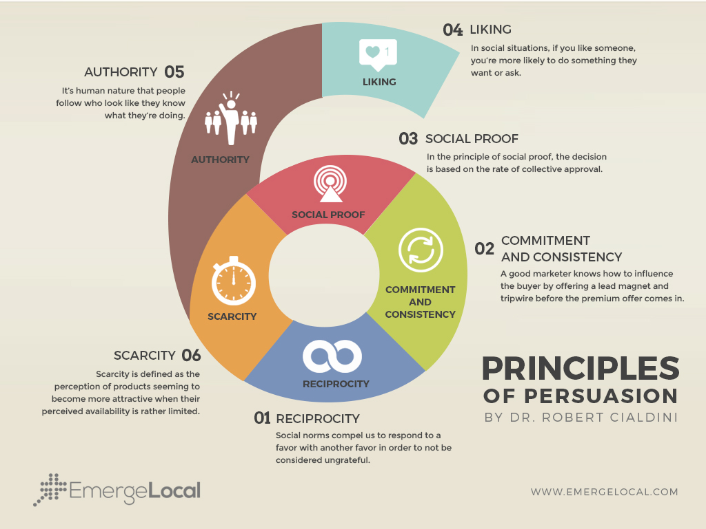
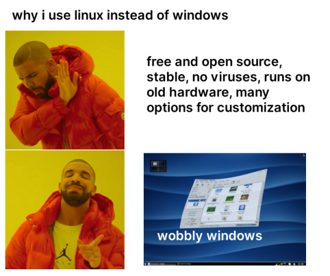

-# Gotta catch 'em all

In short, how to select **which project contribute to**.  
Common question, that for me has an easy answer, but rarely does for newcomers. They are thrilled and excited, but as nerds in a comic books store they have no idea where to start.  

Another issue newcomers face, is an Open Source project using proprietary resources to perform processes or activities. This is a common misconception that may hinder the integrity of the project in newcomers' eyes.  
An Open Source project releases Open Source softwares and solution, this doesn't imply contributors have to use Open Source solutions to reach the goal (an example of this is the use of GitHub or GitLab).  

Basically, an Open Source community may have interests/behaviors different from other Open Source communities, that aren't however conflicting with our expectations, otherwise we won't be involved or engaged at all. It's better to engage, and slowly introduce suggestions/proposals, keeping in mind that this shouldn't happen on our “first day”. Who is going to listen to such a newcomer proposing to amend an established workflow or use different tools while the ecosystem is indeed tried and true and everybody knows how things are to be managed, after all?  

When you choose a community you are not choosing its users or contributors, you can only lead the project and the community itself in accordance with the ideals informing them from the start and follow its code of conduct.

## Just ask yourself few questions

Are you willing to take part in a project?  
Are you feeling motivated and ready for everything?  
Are you willing to challenge yourself?  
So you are what we are looking for!  

You just need to ask yourself that last question: why?  
Contributing to a project without having a long term or personal goal is going to stop you from discovering the project itself or from feeling a part of it. Without a goal it will feel as doing homework in a hurry.  
The personal motivation is important because it allows you to tackle issue, it's like a marathon after all,  you may think you can do it but realizing it takes running for 60 km it's another pair of shoes...  
I see many people contributing to enrich their resumés, as legitimate and necessary as it is, again, this isn't going to help you feel a part of the project.  

You weren't fond of doing your homework at school, were you?  
This way you can give your best contribution and mention it in your resumé, but you are losing the real experience and the learning part that is really going to help you, and also you'll lose the experience of working on a big project with other peers.

Often we don't realize how much our contribution is worth – in the Open Source environment and in other niches – nor we appreciate that what we learn by contributing (sometimes also having fun!) may be used elsewhere.  
One of the trending topic in self-learning is the transfer learning. Famous people like Elon Musk use this technique, so why don't we too?  

I> Transfer learning: the power to reuse the knowledge learned in other areas or from other experiences/people (even if completely different) in other areas or situations.

Joining a project helps us to improve our knowledge and skills in a different context from the one we think it's natural for us, it might be learning a new language or understanding the logic behind a decision.  
In short it helps in strengthening our knowledge by living real experiences instead of “gathering” facts about them.

The experience makes the difference, if it is also followed by meritocracy and satisfaction (normal things in open source) this may help us reach a new point of view.  
In this chapter we will discuss the questions we need to ask to understand in what area or project
people may be interested, these may be useful also for you when looking for something.  
Remember that you need to know how to sell, and that it is useless to propose stuff to an audience that is not interested, it is better to get their interest and engage them.  

## Which questions you should ask yourself?

With recruiting we are talking about onboarding new people in your community.  
There are different types of recruiting and this manual will show the 1:1 approach but the rest of the suggestions of this document works for every type of recruiting or community life issues.

What is a person's goal when volunteering?  

* Opportunity to learn
* Grow in responsibilities
* Contribute with others
* Recognition for his achievements
* Allocating a time slot in their free time

Before moving on, a very good book about persuasion "Pre-suasion" by Robert Cialdini that I suggest you to read (it is localized in other languages too) and uses this recap:

I bought that book while at the airport waiting for the last flight to come back in Italy after a Mozilla's All Hands in US (I don't recall which one specifically) and it has been was very important in shifting my approach to persuading people.  

Anyway I wrote the first version of the doc "How to recruit and motivate volunteers" in 11/07/2016 before reading it and it was surprising for me to discover how much I was skilled in marketing and how much I improved in this field. This explains why I was motivated to run as a candidate for the Reps Council too.  
Back on track, the next pages are based on this document that is still available on internet (and mentioned in Mozilla Reps resources too).  

Think that these points are important to understand how much a project may be easy for newcomers:

* What are the tools to get familiar with the community and for what kind of requests (forum, mailing list, telegram, etc.)? Example: IRC is not easy for newcomers from the UX to access, evaluate other solution like Telegram or Matrix
* What are the tools that the project uses to document itself (manuals, wiki)?
* The most common 5 issues that newcomers have in the project
* 3 tips to contribute to the project
* Why the reader should join the project

Moving to the marketing side:

* Are there big companies contributing or using your project? If yes why?
* How many volunteers do you have?
* How many events do you organize?
* How is the project maintained (private, companies, foundation, etc)
* Interesting numbers or facts that show how your project is changing people's lives

### Rules for the interviewer on recruiting

As talkative Italian I defined these rules for an informal chat (1:1 or 1:many-people) or a way to easier/better identify a (future) contributor. Basically you need to find what people are interested in, the area where they live or the language they speak, the background and so on. Like a job interview but with different meanings.

* Ask friendly, you are talking with a probable volunteer so you can be informal, but don't forget that you are looking for a volunteer and not for a professional
* Get informed about the interests of the local people in the area of volunteering you are looking for
* Share a gadget with the interviewer like a sticker to get a friendly approach
* Say clearly that this chat has the purpose of:
    * trying to understand what are the interesting projects for him
    * trying to define what are the local interests
    * collecting information on how to improve the communication
* Speak about your experience as a volunteer: people love to listen to successful stories and yours probably is
* You are "selling" a community with activities and projects so look for the most intriguing and easy ones
* Tell how your community is organized, don't get afraid to say that something is not working because honesty is very valuable, especially if you are working to improve it
* Tell what are the plans for their involvement
* Let the interviewer talk about him/her(self), everyone loves to talk about him/herself so you can find important information for your purpose in a friendly way: a chat (in Italy with gestures of course)

### Round of questions for the interviewed

{width=80%}

There are many factors that may shape these questions, like the skills of the interviewer, their professional background and hobbies (student, working, hacker) and why is he/she attending the event, so think carefully what to ask him/her.

The first and second rounds of the conversation can be done together in person or online.  
This discussion can be followed with mentoring of the potential contributor after they join the community. This round of questions/chat can be done together so feel free to reassemble it as you want, this is my way of doing that part!

The order of questions is important to understand the needs of the volunteer and what is most interesting to him/her.

#### First round of chat

* Do you know what the project does for you? Even if you are not using the project itself?
    * Ex: What does Mozilla do for you, even if you are using Google Chrome?
It is a simple way to start a conversation about your “product” and engage him/her into a chat about his/her thoughts. It is a simple way to showcase that he/she doesn't know a lot about the product and get a volunteer interested.

An example is The Document Foundation from LibreOffice that fights for open standard in documents that enable the owner of the documents to be the real owner, since he/she will know how the file is created. This comes in comparison with Facebook where you can publish a photo but you are not owner anymore after publishing.

* What do you like about this project?
    * Ex: Why do you suggest to your friend to use an android device?
* Why are you using that project for the first time?
    * Discover the reason of the choice and find others that can have similar interests
* What other volunteer projects are you involved it?
    * Helpful to find projects that can be interesting to the interviewee. This will also help you to understand better his/her background

#### Second round of chat

Now the interviewer can talk about the projects that can be of interest for the interviewee.

**All people:**

* Explain why it's cool to join a community like yours
    * They can improve their skills
    * Meet new people
    * Learn how to work in a group
    * Improve their communication skills
    * Become a project manager, recruiter, translator etc
    * Feel part of a big group
    * Their thoughts are important for the project
* Promotion
    * Share news
    * Do promotion in local events with gadgets
    * Need to know the communities
* Advocacy
    * Like the promotion section but if you would like to advocate for a project make sure you have a good knowledge about the project or a specific part of it
    * Advocating about it in their own websites in their own native language or English
    * Initially a mentor is recommended to review the content

Add also reasons based on your personal experience about issues in your country that can help you to mobilize, like educational topics.

**For developers/tech people:**

* Promote new technologies and add a few examples about what are you doing as a community about it
    * Online/live courses
    * Local group (national or urban)
    * Hackathons
* Talk about new features of a project that can interest for him/her

This people, like me, are interested in discovering new technologies that can improve their performance on the job or just on a volunteer basis.  
At the same time they can be very interested in new technologies, how they work, what they can do and why they are better compared to the other ones.

**For sysadmin/high technical people:**

Usually a system administrator is not a classic tech audience as we usually think, they are not developers, but they are up-to-date with new technologies especially since that is part of their daily tasks.  
They have no time to engage on developers' specific topics, but they love to talk about “changelogs” or news about technology.  
Often they are also open source philosophy lovers, or they advocate a lot about security so this kind of topics are precious to them.  
Sometimes they don't have social profiles or smartphones, so they are not interested in social media because, simply, they don't use them.

* Talk about the last feature of a technology:
    * Ex: Do you know that Firefox Nightly is a lot faster and support etc.
* Talk about internet freedom issues:
    * Ex: Do you know about the copyright issue on doing selfies etc.
* Talk about a new software that can change their daily workflow
* Talk about how much fun and interesting it is growing skills

**For students:**

* Talk about the skills that they may learn
* Promote the recognition they may get that can be useful for their studies
* The students coming from the same city can join the forces in their school or universities and work together
* They can meet other students across the country with the same interests

They love to work together, learn and have fun. So you have to be prepared with easy to find and fun activities for them.  
This way they can see that is cool working together across the country or globally.  
High school students are a complete different case, they have a lot of free time to dedicate but very poor skills/English knowledge.  
They are the most difficult to recruit because you need to motivate them with something playful and spend time on mentoring them.

**For non-English speaker:**

* Which are your preferred activities on the internet?
* What is your job?
    * You need to find an interesting area for him/her, if they are promoters for example, they probably may be interested in organizing an event
* What are the problems you are coming across in the projects?
    * Ask their suggestions, get in touch with them now and not afterwards with an email
* You can improve your English skills contributing

People can be less interested joining because of the language barrier so you have to find quickly something interesting for them and get in touch to convey the feeling that their thoughts are important even though they don't speak English.  
DON'T FORGET to leave a reference to the interviewee to contact the interviewer!  
Also, they are volunteers, not coworkers, so while everyone can be fit for these roles, you need to be sure there are other opportunities for the volunteers, that you simplified during the interview.  
It's true that not everyone can be a volunteer since not all the skills can be used on the current projects the community is involved in, but they can be always useful for promotion or advocacy.

# Conclusion

There are a lot of ways to interact with newcomers or noobs (to use a synonym from the videogame world) but often a map is one of the best way to show the community dimension and also where they can find others.  
For some projects in Mozilla I developed a map that you can find as [boilerplate license in GPL](https://github.com/Mte90/List-People-on-the-Map-Boilerplate) to use as you prefer or get inspiration from.
