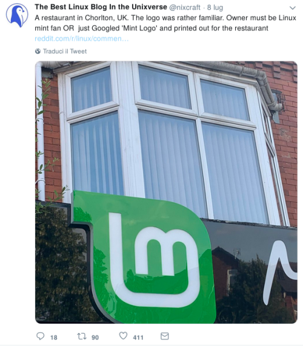

-# What are the most common areas of activity?

Prerequisite of the activities to propose is the mentioned chat. That way the volunteer is ready to do something, not alone of course, but with your help.  
Remember Open Source is not just project promotion but everything that let the project alive, contribute in other areas can help your overall view and open new ideas to move further what you are doing and the project itself.
They get confidence with your help in the project without experiencing the huge barrier of a link with a list of things to do.  
It's not always possible to have that chat but in my experience without that the volunteer will always have problems to understand something of the project – why is this so or how that works for example. 

So if you get familiar with someone that already started to contribute don't forget have a chat like this because it may help the volunteer and your approach to the communications in the project itself.  
Also,don't be scared by the amount of things that you can find, think small and step by step. Like when learning to swim or ride a bike.  
You won't do everything from the first day, but slowly and based on your needs and skills, so let's do the same also for these activities.  
(Perhaps) one of the reasons Unix and Linux became so popular is the KISS philosophy.

I> KISS in short or Keep It Simple Stupid states that most systems work best if they are kept simple rather than made complicated

If this works with systems why can't it work with your tasks?

I will mark with *D* the activities that can have a direct effect on the project and *I* he ones whose impact is difficult to measure but are part of the things people can do even if they aren't active members of the project.  
Also, I divided the various areas by level, the higher the level the more experience is required in the project or for the type of activity (basically some activities require skills that you might not have).

Just before reading the next chapter, ask yourself this questions:

* What do you like to do?
* What are your skills?
* What do you like to learn?

The answers to these questions will give you a personal overview of the area or topic that you want to get involved in within all the open source projects around you.

PS: The joy of contributing happens when you see your change/improvement/localization/etc being used by everyone, and they don't know you are the author.  
The biggest gratification of a volunteer is the activity he did is used by others!

Imagine your contribution to the project and the effect of other people on what you are doing to get a boost of motivation!

Just a little note, there aren't only common areas but also tasks that are often repeated or that happens periodically, those are areas where a new volunteer or a contributor can act to improve the amount of time used to dedicated on something more important.

## First level activities

### Reviewing *D*

This is the simplest activity for a new volunteer that can help you so much (as already said)!  
Think about it, you created a documentation, a paper, a design etc and you need feedback before going live and why not ask the new volunteer?  
In this way they can make it an important contribution (a fresh eye on docs and the like) for that project and be involved in something very easy. At the same time they learn something about your activity.  
Moreover, this task can be performed without a group, enabling to you to prepare something a little more advanced and understand how that volunteer works.

### Localization *D*

Start from something that hasn't specific rules to see what are the skills and English knowledge in a group.  
The rules of localization can hinder their interest or they may be something they have to learn, and this may slow down their interest.  
A new volunteer wants to do something without having to undertake a big course/onboarding to see if fits him.  
Moreover, technical glossary may create a problem because the project can use specific terms and the volunteers don't know or understand them yet.  
Every project usually has rules or guides about how to help on localizing and is something that everyone can do.

### Support *D/I*

These activity requires a knowledge of the project, so I don't suggest that initially, but only for the people that are going like it.  
Probably a combo will be to translate something about Support.

### Testing *D*

This is very important, as is the reviewer, because they can learn about the project and make it something to improve it. It follows reviewer rules.  
The difference is that Testing consists in trying to find problems or bugs while Reviewing on the other hand consists in writing a document including all the problems without going in depth about implementation but only to receive feedback.

### Promotion/Evangelism *D/I*

Promotion is very important, you can have the coolest project but if the rest of the world is not interested, it will die.  
This is a lesson I learned in the startup world, often the most successful company may not have the best project but is promoted better.  
Remember, a community without new people or engagement is dead, because people can lose interest quickly and fairly easily.

A community in this field has 3 macro areas:

 * Social networks
 * Events (that has another section)
 * Assets

Social networks are very important today and often they are not open source but you have to go where people you want to reach mingle, so you need to use it.  
It is not the purpose of this book to move people among social networks, This approach IMHO is a very huge failure. If you are selling carrots, it doesn't matter if the people will use them for a salad or a soup, you have to promote it, not to tell people what is the best way to get updated about carrots, that is a very highly forced behavior on your part.  

There are a lot of tools that let you to create a team to schedule posts and reply on social networks, at the same time it's important to define rules on how to use them. This because it's going to be an official communication and you need to preserve the brand and avoid conflicts with it.  
So you can involve volunteers on suggesting what to share or to do public chat/AMA about different topics.

Instead, assets is more on the organization side, you need graphic assets to share like posters, flyers, logo and so on. This is very useful to better promote your events, and they can still be used after years from everyone.

Maybe this is kind of excessive but it's a viral and funny joke in the open source community.  
You can't promote your project without a logo and assets to build the website, also posters or other kind of material that may be used for promotion (also from outsiders).

### Advocacy *D/I*

Sometimes this area gets hidden but it's very important if done the right and useful way.  
How many of you are bored of hearing about the 4 laws of Open Source? And which are the benefits of OS solutions (free and that you can modify it to your needs/likings)? I think we can move on.  
The project needs more buzzword to get promoted and to have a chance to fight with other competitors, so let's see some examples:

* Promote Open Standard for documents because there are proprietary softwares used by doctors that are not compatible with one another, so our health data are closed but can save your life
* Promote Open data because it is possible to track and discover new things around you for they are catalogued. Do you know what is the amount of masterpieces closed in the Italian museums' warehouses because there is no space to expose them? Without exposure, you will have no idea about how much one single information can change a lot of feelings.
* Privacy is important because it's possible to identify you even if you are navigating in private mode on the internet due to the proprietary feature of your browser full of bugs.
* Open source doesn't mean it is free, but that the project is under a license allowing specific things. So it's sometimes possible to get the code by paying it for example, like in WordPress plugin/theme ecosystem.

Those are examples of advocacy 2.0 for open source projects. We take an important fact that involves everyone from the newbie to the non-IT aware person, leaving a fewdoubts behind so people will remember the whole point and giving information about something new that they don't know. Also, giving people a choice without being a dictator but motivating them to discover more and not only by talking about your project.  
For me this differs from promotion/evangelism because the purpose here is to motivate people to discover more and engage, not only get a gadget or something new to promote.

### Event *I*

Often events are seen like amateur gatherings where friends meet to always discuss the same things.  
This is true, but it's also a way to network, find new people and approach them to promote live. If you want to talk about open source for students you have to do it in a school and you'll have to consider what they may be interested in.  
Organizing events and giving talks or hosting workshops is important. It's a huge way to interact with people, understand their mood and motivate them. Humans are social animals that need interaction, and sometimes they need to meet also offline.  
The people you engage in events are more prone to be engaged later as volunteers, because they see other people like them or that is possible to contribute because the others are akin to them.

## Second level activities

### Documentation *D*

I already talked a bit about that previously, but I want only to repeat that it is very valuable for the project brand on the long run and to improve the quality of the project.

### Community management *D*

This is a very important task that requires a lot of patience and good communication skills in addition to management abilities.  
The community is build around calls or meetings that need to be arranged periodically and documented (there is a guide in the appendix), understanding the various roles for the volunteers, organize the project/resources and recruit and motivate, write reports and proposals.  
Also, this is a very important role because usually it is a bridge between new volunteers and the project itself, because people see them more often.  
There will be a guide on how to motivate volunteers in the appendix, because also the most active one can have his/her moments of doubt or other things to do, and we need to re-engage them later, or we can easily lose their help.  
A little suggestion, don't forget that the community likes to be involved in decisions, because the project is open, so defining ways to let them join in it's very important.

### Development *D/I*

If the project has a software, well they are important!  
Without skilled developers the project will be dead in short time, because it will be abandoned and you don't want that.  
People with skills are required to lead it and plan what to do, but also to mentor new people and simplify the onboarding. The development area usually has a very high learning curve to contribute and it is important to have a balanced way to access it.

# Conclusion

Open source involves a lot of areas where you can find a home for your interests and people like you. Just pick what you prefer and start to go deep and discover how it really works.  
The usual excuse I have not idea about what to do is only a bad excuse after reading this chapter.