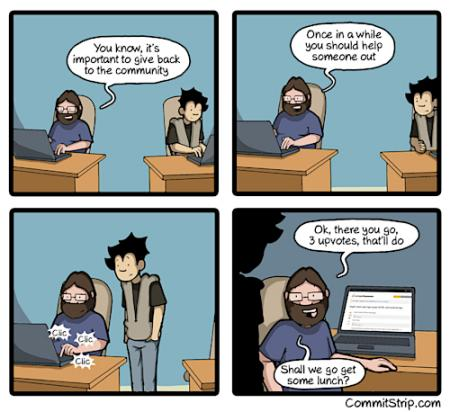

-# How to find the most important value that you have: Time 

This is the biggest question that others ask me when seeing my contributions, or when they are interested in doing something.  
I can't talk in your place, but there are different ways to save time and I will show you my way and few tips.  
Remember that giving your time is already contributing, next step is to decide in what you are contributing.

Yes, not everyone has time and it may happen that the most qualified people don't have it, so they can't grow in the Open ecosystem. This is something that the project can't change, so they can help on increasing engagement of  newcomers in simple tasks and because of that they will find more time for contributing.  
If we find time to watch a TV series, a football match, play videogames, eat and so on and so forth, it is because we have an interest in that.

Don't forget to consider your job in that, it isn't something that you can do quickly but you can help on changing the mindset of your workplace to understand the power of it. From specific tools or projects that improve your products to better tools for you. Maybe your company will see it is good that you invest your time on contributing because the company gets what they need and maybe also an improvement of the brand itself (other than more skills for their employees).

So without your first steps you can't think to do something, time doesn't grow on trees. It depends on motivation but also on a good workflow that improves your daily life.

{width=60%}

My workflow is based on:

* To-do list
* Optimization of tasks
* Use your boredom/break times

## To-do list

I contribute in a lot of projects and usually it's because I need something for my job, for my needs or because I want to help.  
I ordered them according to their priority and again that shows also why contributing is important because it may improve the quality of what you can do in your job.  
With work, I mean a patch to something that I need to use, open a ticket for an issue, translate something or also merely study something and do a new project based on others.  
My needs are specially to enhance the next part of my workflow but sometimes also for daily usage of my workstation, like a browser extension or a script to automate stuff.  
I want to help: this instead is based on my free time, but how I can merge all of them in my daily life?  

I have a wall of post-it, browser's bookmarks of tickets, notes about things to do and so on. I prefer to write any idea to free my mind about those thoughts and focus on something else, maybe I can recatch them after days or weeks.  
I order them based on the priorities and based on performance time and the third part of the workflow. Another point is also part of the project management, check who can do that task and propose it to him/her. In this way you are motivating a new volunteer, becoming his/her mentor (maybe), using the skills of a new volunteer and saving time to do something else.  

Learning to delegate is very important and lets you focus on the things that you can do better, in the meantime onboarding new people that (maybe) can help you on that task later.  
Another suggestion in case you have tasks that you don't want to do it, instead of doing them later is better to do them as first. In this way you feel more relaxed and free to do the rest of things in queue.

## Optimization of tasks

This is very personal and I suggest you to read a few books (check the appendix); anyway for this I suggest to have a look to your tasks. When you do something always in the same way many times a day/week, maybe is time to find a solution to simplify, the machines are perfect for this kind of tasks.  
One solution may be to get a mouse with side button to switch tabs or hotkeys to launch programs (or to learn the hotkeys themselves) and so on.  
For this I suggest checking the Kaizen philosophy, that is basically a way to do a little change that improves something and continuing to perform a lot of tiny changes that in the big picture create a big puzzle completely different from the previous one.  

As example after optimizing the usage of the keyboard I moved to optimizing my daily routine, like checking the news-feed after lunch or saving things to read during “news-feed Moments” in the bookmarks during the day. Also, try to dedicate a specific amount of time to emails every hour or day based on the momentary needs and this is another way to aggregate stuff that requires your attention.  
Anyway, this can be stupid, any second you save is a way to do something else and make a better use of your time; with tiny steps you can see more tasks that you can optimize like improving the spam filter settings of your inbox or a new feature of your computer. The optimization doesn't need to be intended to save time for open source but time for you to use for what you like but also to be faster.

## Use your boredom/break times

In my workday in front of a computer I do a lot of things because between tasks I take short breaks, during them I check my todo list and the one that I want to do (based also of the time that I want to invest).  
As example, I do an important task, I deserve a long break maybe 30 minutes or more, so I can perform a task about something I like. This kind of trophy seems like a dog's treat <that was a good boy>, a lot of coaching books suggest this technique because it improves your attitude on the job but also your mood.  
Getting a break is helpful because it resets your brain so you can start fresh (even for 30 minutes) and work again on the same task. That's also true if you hate it or didn't find a solution before.

They suggest a piece of chocolate, I do something else. Also, doing such breaks during the work is a way to not get distracted or tired working at the computer, we easily switch to different things keeping the attention span working. Of course, I sometimes dedicate the afternoon to something specific,it may be work or an open source task but it's on me to decide based on the priorities what to do.  
This should happen to you also, in this way you can better value your time, your work and get more satisfaction from it.

Another way can be defined as a hobby that you want to invest your time, as example for myself for an year I worked to improve my knowledge in other spoken languages. In this way you can appreciate more how you are using your time and define what kind of break you need based on your time availability.

## Leadership

It is a fact that veteran volunteers become the reference and usually are getting a lot of requests for help or for their feedback on something.  
Those are difficult to plan but it's possible if you leave a spot in your day to check if you have this kind of requests.  
Leadership without involvement is impossible, for this reason usually when there is someone that wants to lead and no experience, there are no interests on what he is proposing. This is kind of normal, you need to get the respect from the community in this role, taking care of it by replying to the requests is important.

## Delegating

Delegating is not an easy task, especially for founders or people that are involved a lot in any situation. Anyway this is the first skill that any leader need to know to achieve any goals of the project.  
To delegate doesn't mean loosing control but instead a way to empower others (and grow the project itself) as we say above i this chapter.
As contributor or leader it is important to empower others to create better relationships but most important to do a better team job and create a better team.  

The benefits of the delegating can be very surprising because with empowering others there will be probably new opportunities to grow or change something that you never think of.  
The real benefits to you are first of all for your health (avoid burnout), understand what are the things that only you can do and what are the area where you are acting as first person.  
Understanding this role, tasks and area is important to have some numbers, see bottleneck, open new opportunity to grow and so on. An example is: you have the password for the various social accounts but they are dead because you are busy on fixing bugs or localizing, instead you can create a team or delegate to someone that you trust to follow it for you.  
Another one: your project doesn't have any documentation because you want that everything is perfect and the project is not yet ready for your standards, but someone that has better writing skills can do a documentation also for the actual status of your project.

Another important fact about delegating is to avoid gatekeeping. Gatekeeping is one of the bigger issues (for me) in the OS world.  
Basically block the access to important roles or onboarding of new volunteers in the project or in specific areas. This create a bad mood inside the community, bottleneck, feelings for a fork, bad reputation of the project, revolution or refactoring and many others. Basically block innovation inside the community and your work because there is no new people that can replace the other ones that maybe are busy or left the project.  
In other words a community with gatekeeping is a community/project that is going to an awful ending.

## Burnout

About this topics a lot of people with better knowledge than me wrote a lot of books or [websites](https://selfcare.tech/).  
My experience is basically to understand what are the priorities and define time slot, where after that you don't care except very important things (it is a skill to understand what are those).  

Usually burnout has different symptoms: isolation, feeling undervalued, recognition, values conflict, loss motivation and lack of autonomy.  
There are some things that you can do quick easy: automatize tasks (I use the rule of 3), understand what others are doing and how, communicate better.

I># Rules of 3
I> I don't remember where i found it but I have my own version: if it is a task that I do with the computer like 3 times a day or for week always in the same way you need to automate it. Especially if this task is based on a lot of steps that can creates confusions. In case it is something where you cannot use a computer there are other ways to automatize things in this days with Zapier or IFTTT or if you are a developer you can find some ways.

# Conclusion

I can't show you how to save your time. It is on you to analyze your tasks and your time and understand how you can optimize it to do whatever you want.  
The first step is to learn from others, for example I like a lot to read about how big companies or projects changed (or explain) their workflow like in those examples:

* [How WhatsApp scaled to 1 billion users with only 50 engineers](https://blog.quastor.org/p/whatsapp-scaled-1-billion-users-50-engineers)
* [Shipping a security update of Firefox in less than a day](https://hacks.mozilla.org/2018/03/shipping-a-security-update-of-firefox-in-less-than-a-day/)
* [The 2022 r/place story from the Italian view (and from bots)](https://daniele.tech/2022/04/the-r-place-story-from-the-italian-view-and-from-bots/) - This is mine
* [Lessons learned from my 10 year open source project](https://medium.com/@micallst/lessons-learned-from-my-10-year-open-source-project-4a4c8c2b4f64)

Or reading post mortem/outage after big bugs or hardware failures:

* [Mozilla Add-Ons Outage Post-Mortem Result](https://hacks.mozilla.org/2019/07/add-ons-outage-post-mortem-result/)
* [GitLab.com database incident](https://about.gitlab.com/blog/2017/02/01/gitlab-dot-com-database-incident/)
* [Facebook: More details about the October 4 outage](https://engineering.fb.com/2021/10/05/networking-traffic/outage-details/)
* [Retrospective and Technical Details on the recent Firefox Outage](https://hacks.mozilla.org/2022/02/retrospective-and-technical-details-on-the-recent-firefox-outage/)

Why? Because in these stories you learn a lot about work organization and how to organize yourself and others with a real story, like a novel.  
Also in those cases it is important to save your time and do what you have to do very quickly. Don't forget that Open Source is basically learning from others and using this rule also in other context is useful after all.

Just think about it because in this fast world where everything changes so easily is important to understand time's value.