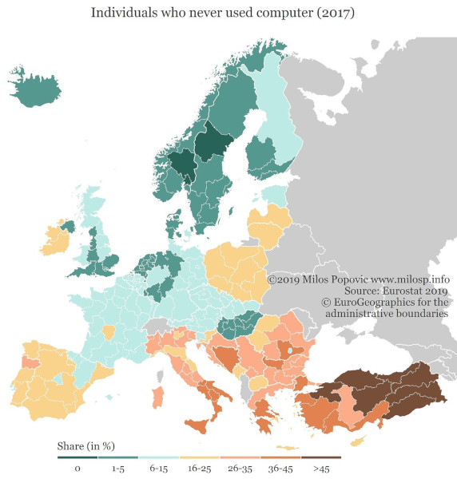
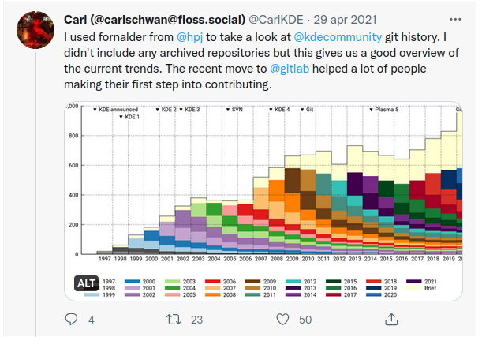
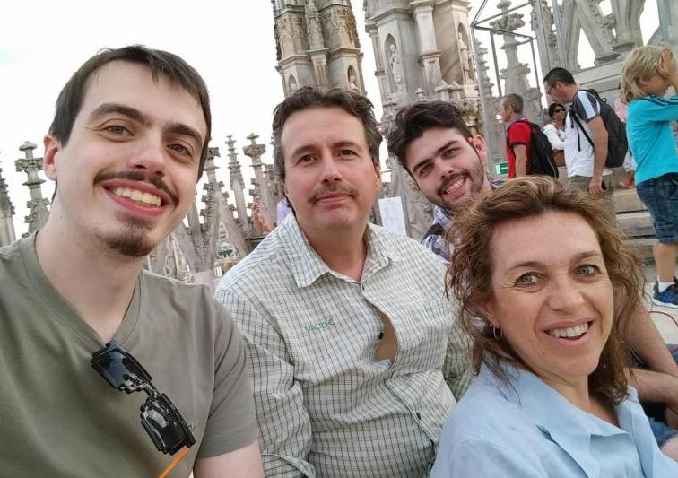
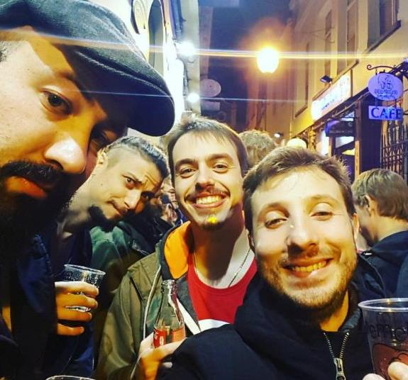

-# Conclusion

## What is the future of the open source world in the next years?

Open source was a scary topic years ago, they used to see you as an amateur. This is a fake news today, it is also that but not always. Only because it is free doesn’t imply that it’s an amateur thing but it can be a good alternative.  
Do you know Volvo invented the seat belts but the patent was set up as free to use for all to improve the security for everyone?  
I think we need people to discover how the open world changed everything already. For example, we could grant them the opportunities to participate during a time slot in their working hours.

From the routers in every house to connect to the internet, that are cheap because of open source technologies allowing internet to spread everywhere and so on.  
We as people need to let the rest of the world be more conscious for what there is around, as we are doing with climate change.  
Take as example the power of the **Open Data**, that in some countries are unknown or discouraged from the public governments (I am pointing my finger to you Italy) and how much they can change the approach to the big archives that every country has.

The future is “We need more conscious people in all the topics”, with internet we have the knowledge within a tap’s reach (not only a click with the mouse) but we are not using it the right way. We need to consider the idea that they don’t know something and need to understand what they miss, in this case why their using something and if there is something better for different reasons.

  

Basically we need to move on those points (explained in the next sub chapters):

* From “Let’s migrate to Open Source because is free” to “Let’s migrate to Open Source because it offers more features”
* Evolve the concept of the license
* Be more user-friendly
* Get better promotion
* Open source doesn't mean release the code

### Use Open Source software because is better not because is free

Just this title has some issues because Open Source != free, take as example WordPress ecosystem or other CMSs where additional software is sold but the code is public (and not obfuscated/minified). A software can be open source but this doesn’t mean that it’s free, it needs to follow the 4 freedoms that don’t mention the money factor.

We as community and users need to move on the open to this new level, it isn’t anymore a matter of money as before. Taking as example LibreOffice having to compete with Office 365 that is a cloud service sold to public governments and is cheaper than Office suite to install in the computers.  
So IT departments prefer Office 365 because they don’t need to take care of supporting it, installing it and so on (welcome to the cloud baby) but this opens the door to other questions. Where are the files hosted? In what country? There are secret/privacy information on them? If I cancel the subscription what it’s going to happen?  
Open source lets you run software in cloud, but we need to change the approach on promoting it because the old slogans don’t work anymore.  

This was the way people abandoned Internet Explorer, not because Firefox (the biggest competitor at the time) was free but because it was better, as Media player against VLC, WinZip against WinRAR (everyone used it without buying it), WinRAR against 7zip etc. too.  
Now people don’t think to these tools anymore if they have better ones (biggest example Firefox Vs Chrome or Chrome Vs Chromium).  

This is also part of the fact that big companies and a lot of projects in the world use open source components without giving anything back, no money or other types of contribution. The biggest disadvantage of open source basically, but that it’s not the right way to work in the open source world properly. Those days there was a lot of discussions about funding an open source project or the maintainer itself, it’s not very easy but is something that the users should ask every time they use something for free.

### Evolve the concept of the license

It is cool to get the source code but is quite useless if it is not possible to run it. It is like when I got a Blu-ray DVD as birthday gift but I had only a DVD player that wasn’t supporting it.  
Today with the cloud we need to understand that the code access is enough to be open.  
[Frank Karlitschek](https://karlitschek.de/2019/08/open-source-if-more-than-licenses/) (the creator of Owncloud and Nextcloud) explained very well the issue. The 4 freedoms were created when the computer in the home was the unique way to access a software, now with cloud and mobiles there are different kinds of resources. Access to the code was enough to get Digital freedom, but now it isn’t anymore. Our data are not anymore our files but also our interests, our photos and so on.  

Also the [Open Source Initiative is evolving](https://opensource.org/sites/default/files/public/2021-OSI-AnnualReport-final.pdf) and now the membership is not only paid, in this way they tripled their members (500/2000) and improved their workflow on evaluating licenses. To reach more people and improve the awareness is important to go out on our own bubble.

Open source is for me when:

* The code is open source
* There is a community leading the project (behind a company too, like in Docker, Kubernetes, or Arduino)
* There is no Dictator (I don't mean the Benevolent Dictator for Life)
* All the files to use it are provided (like Machine learning models as Mozilla’s DeepSpeech with Common Voice)
* Everything is documented and following a standard
* Release management is not happening at the time of major releases only with a cadence of 3-4 months (or less) (people need to be aware of the changes and to be able to deploy without any hurry)

I># Benevolent Dictator for Life
i>Or the BDFL is a one person that lead the project future, usually is the founder/creator of the project. Also this role has the last voice on every discussion and in some projects this is important because helps on closing discussions or getting a decisions and avoid too much flame wars. In Linux as example is Linus Torvalds, in Python was Guido Van Rossum, Larry Wall for Perl and so on (they created the project). The point to say Benevolent is because as it is open source it is always possible to do a fork with new leaders if there are big issues, for these reasons is a Good Dictator that act only when needed.

### User friendly because not all the people love the command line

A common problem years ago was that open source software was very ugly or difficult to use even if powerful.  
Now that has changed but not all the projects are offering user friendlyness, this is a problem that requires more people testing and also more UI designers helping with that.  
The [Open Source Design](https://opensourcedesign.net/) community is the first example, also KDE with their [Usability & Productivity](https://pointieststick.com/category/usability-productivity/) newsletter and Mozilla with [weekly updates from the nightly version](https://blog.nightly.mozilla.org/) or [The Document Foundation](https://blog.documentfoundation.org) that often release stats or updates about the projects.  
User friendly is not only a better UI or cool logo (that changes every few months, yes Mozilla I am talking to you) but informing the people about the updates during the cycle to involve them more.    
Other projects involve them more because they offer more news and people can *gossip* like a TV series, well humans are simple sometimes and is something that the open community can replicate.  

Communicating better and being more friendly in everything (the purpose of this book indeed) are the future.

### Communicate better to fight who has the money to sponsor everywhere

The legend that “if it is on all the billboards it means it is good” is not true. The high competition in the digital world changed everything.  

We can promote it without money, if we make that together and if the project provides the promotional materials.  
In this case not graphics assets or gadgets but data to share. The scandals of the last years with social networks have exposed the fact that data are the new currency that if used the right way may also change an election, so let's figure out how to use it to promote the open philosophy better.  
Not only the machine wants data but also people because we are in the world where facts don’t matter and only real data, a lot of it, can change this bias.  

Open source needs more marketers, a sector that often isn’t involved in open source because they don’t care (maybe) but it’s a fact that we need them.

### The code is not enough anymore

Today if you ask, to someone that develop or is involved in IT, "What you will do with your project if you have to release it open?" the answer will be "just a zip of the files put online".  
As we saw in this book Open Source doesn't mean just release the code but let people to use it and also discover it.  

A real example of this is the release of the source code of an indie game, VVVVV that was announced as "VVVVV goes Open Source" but the project didn't had a good license so it was forced to change the announcement with "source code release". There is the [original blog post announcement](https://distractionware.com/blog/2020/01/vvvvvv-is-now-open-source/) with all the blog post comments but with a research is possible to find also various tweets and discussions about this misunderstanding.  
So the code or the core of the project publicly available is not enough because you can only read it, as the legal definition of that is a proprietary project. Without a license that explain how you are allowed to use it is not possible to do anything. Think about of Doom or Duke Nukem open source releases and how they changed the world, also other games that released piece of that letting creating of new games or create new technologies.  

The other point is the promotion, with GitHub/GitLab a new issues awaken, someone start a project, release the project with a license and so on. At a certain time the owner is no online anymore or interested on working with that and the project became an abandonware. So a new developer take it with the creation of a fork, the problem is that for the rest of the world maybe this new hope is unknown. All the links and information refer to the original that is abandoned so no one will find the fork. Like a Jedi need to master the force and knows all the aspects of that, also with a release public you need to be ready about what means.

Often the best solution is the one that the maintainers or veteran think it is the best but with new technologies there are new solution that simplify various taks that for new people can be very difficult to do.

Personally when I find abandoned project I ask for updates or looking for a new maintainer but often is very difficult to get an answers. Pinging on Twitter or other social media (not everyone publishes their private email address) so the joy of contributing or access to nice things crash against a Death Star, that is the oblivion of the abandon.

So we need to evangelist better this fact and explain that the code is just a piece of the brand and the meaning of the project.  

I don't want to forget also that FOSS is not just promotion. With fediverse and new people discovering this world I see more people that want to do promotion but it is something that we need after all? In this book I talk a lot about communcaiton and promotion, at same time there is promotion that change things and promotion that is useless or not working.  
The project need it but often is more important instead to be one of the fan in the stand to be the player in the game, maybe not the player but maybe the coach or the the doctor.

## The Italian case

I am writing this section in English but is focused on the Italian situation about digitization and awareness about digital matters.  

In Italy the Covid period was one of the biggest reasons for upgrading or understand that digitization is something that improve the life/work quality (like in other part of the world). The real difference (to me) is that involved a lot the public administration that was always very slow on updating itself but also on the knowledge of the public employees that now were forced to learn a bit about how to use the computer, not just to play Solitaire.  

Open data are matters of various association as they are not easily public as digital rights ot Italian government propriety like the Colosseum. Let's split in two different paragraph.  

[Open data in Italy](https://dati.gov.it/) have various issues from the license and the quality of them (when they are available), infact [DatibeneComune compaign](https://www.datibenecomune.it/) with 58110 signers and 287 organization works on improving this with a monthly newsletter that can let you to keep updated about what they are doing. The Government now opened to the discussion to the [Open Data guidelines](https://www.datibenecomune.it/2022/07/18/datibenecomune-ha-scelto-di-prendere-parte-alla-consultazione-sulle-linee-guida-open-data/) that is like the first time that is happening.

The [Freedom of panorama in Italy](https://en.wikipedia.org/wiki/Freedom_of_panorama#Italy) doesn't exists also if we are famous for tourism. At the end from a 1941 law we are locked to a definition that says that photographic reproduction of public space are allowed if not creates competition against the economic values of the object. This creates issues on Wikipedia side as it is not possible to make certain photos to the [Pisa Tower](https://en.wikipedia.org/wiki/Pisa_Tower) or [Castel Del Monte](https://en.wikipedia.org/wiki/Castel_del_Monte,_Apulia) and publish it under a Creative Commons license, if there isn't any act that allow for any of them. The recent European law about copyright didn't helped on pushing changes to this law and every year for the Wiki Loves Monuments (global photographic competition) for every local public government they send a request with a list of monuments.

From the software side instead, since the born of the [Italian Digital trasformation team](https://teamdigitale.governo.it/en/) various things are changed. Not just the [Official Forum](https://forum.italia.it/) but also the procedure on what they are doing with [GitHub](https://github.com/italia/) (278 repositories as now).  
There are public projects like templates for WordPress, GUidelines (with web version on ReadTheDocs), mobile apps, SDK, design kits and others.  

This was something that 5 years ago was something that maybe for a Hard Sci-Fi author was impossible to think of.

Two things are very interesting for the purpose of this book about what they are doing.

### PublicCode.yml standard

`
A metadata description standard for public software that is easy to use both for developers and people with less technical background in order to make the software developed by Public Administrations and Public Organisations easily discoverable. 
`

In few words a file that you can put in your git repository that is like a identity card that allow to index it with references to the maintainer and dependencies.  
The idea is to improve the discoverability and if that project is suitable for a public administration and to use the standard also in other countries.

## Catalogo del software di Riuso

That in English "Reuse Software catalog" that Italian public administration can use it. As every big organization departments don't talk each others, also cities or region but they have often the same needs so why develop multiple times the same software?  

This is the idea at the end, a way for public administration were often managers have no so much knowledge on IT to find software already available and open source developed by themself or by others like LibreOffice as example.  

This projects uses the standard we saw to fetch the software list but the website is more friendly as includes more information, not just a description but people that you can reach to asks question. This is something that for a bureaucratic organization is important and that in OSS is ignored often.  
After all if you are maintaining a project you don't want that people reach you for questions about if the software can do this or that, or if you can implement something just for them. Especially if it is someone that maybe will pay you...

This is an example about how improve the awareness to organization that is not like the usual software alternative list, because can give more information that are valuable to the people in charge of decisions. 

In a first world country there are limitations or issues like elsewhere but is important to see that internet, public awareness and young people are changing the situation. Also if the [italian case](https://profilo.forumpa.it/doc/?file=2021/2021_FPA_Data_Insight_Lavoro_pubblico_2021.pdf&confirm=yes) seems that in the public government the people under 30 years old is the 4%. Especially in [School institution the age average is the 58% is over 50](https://www.truenumbers.it/eta-degli-insegnanti/) but in Ocse countries is the 35%.

I know people in Italian universities that still asks questions about Floppy disks to students of psychology as example or that teach using computer with very old operative systems because the professors doesn't know how to use the modern ones.

The open source awareness let us spread all those ideas and change the situation, takes a lot of time but gathering various pieces we are getting something. To do this changes is not required evangelism but also facts like what I am saying. Not just "Ehi that city migrated to Libreoffice" but people that does things, develop software and explains things in a way that the [listeners can understand it](https://docs.italia.it/italia/developers-italia/guida-sviluppo-gestione-software-libero/it/2022-05/index.html) (Like the Italian guide by the Digital team for managers to understand OSS and how affect them). Maybe with a catalog with unusual information or showing the issues on various laws.

## Thanks

As I already said, I decided to write this book because I wanted to gather all the things I documented over the years, my thoughts and share my experiences.  
My experience level couldn't be as it is now without the help of a lot of people:

  

* My family because they taught me that "A lot of people talk about how to do things and very few on doing them". Without this imprinting, and without my Catholic faith too, is very difficult to imagine my involvement in Open Source. As humans, we have the power to change the world around us, complaining is right only when people eat pineapple on pizza.
* My collegue and associate, Eugenio Petullà, that allowed me to be free during work because what we do for open source is important and brings value to our web agency and our skills. I know that he uses Fedora and Gnome and I use Debian Sid and KDE, but I am trying to ignore this problem.
* Edoardo Viola, leading with me the Mozilla Italia community, who helped me on confronting with others and cooperating in the leadership of a community too. He is a professor now and I hope to get a good rating for this book, but please no oral interview!

  

* Mozilla community for all the things that they taught me, for all the things that I did there, and all the opportunities that I got. Just to mention few people: Michael Kohler, Konstantina Papadea, Ruben Martin, Elio Qoshi, Andre Garzia, Michael Ellis, Anthony Maton, Yofie Setiawan, Irvin Chen, Christos Bacharakis, Tim Maks Van De Broek, Ioana Chiorean, Henrik Mitsch, Ankit Gadgil, Francisco Picolini, Brian King, Havi Hoffman, Jean-Yves Perrier, Catlin Neiman, Emma Irwin, Alex Lakatos.
* Mozilla Italia community members for their involvement in the community itself and for what we achieved in the years, together: Sara, Saverio, Giovanni, Edoardo, Eugenio, Michele, Simone, Damiano, Gabriele, Stefania, Aronne, Niccolò, Francesco.
* The founders (Marco and Vincenzo) of Industria Italiana del Software Libero, may our idea to create a national group of IT professionals in Italy be an achievable dream and not only a group of friends (Also Emilio, Stefano and Giancarlo).
* WordPress community, even with all the issues I have with the actual project management I am still involved because I trust the people more than the project itself (now).
* To all the other people in other communities that it’s always a pleasure to meet and chat with: Italo Vignoli, Enio Gemmo, Giordano Alborghetti, Gabriele Ponzo, Gianfranco Buttu, Roberto Guido, Marina Latini, Saverio Giulio Malatesta, Emiliano Valvassori, Dario Cavedon, Fabio Pietrosanti, Luca Martinelli.
* All the reviewers for their time and lots of patience on finding English mistakes and suggesting new things that I forgot: Rizki D Kelimutu, Marco Lombardo, Elisabetta Carrara, Konstantina Papadea, Michele Nasti, Takeshi Hamasaki, Stefano Cassone, André Jaenisch.

## Books that you need to read

* [https://github.com/OpenTechStrategies/open-source-archetypes](https://github.com/OpenTechStrategies/open-source-archetypes) - "A field guide to open source project archetypes" a study paid by Mozilla about the various “business models” that exist in the Open Source ecosystem. An overview about the ecosystem and maybe on something that you don’t know.
* [Open Source Motivations](http://mzl.la/whyopensource) - A Mozilla study with 30~ volunteers of 2016 (I am one of them) "What motivates contributors to give their time & skills to open source projects? A qualitative study of the motivations and experiences of Mozilla communities members."
* [Mozilla Reps Leadership Resources](https://wiki.mozilla.org/Reps/Leadership) - A collection of resources to read about community management and leadership.
* [Open Source Guides For The Enterprise](https://www.linuxfoundation.org/resources/open-source-guides/) - by Linux Foundation - A lot of information to move your Open Source knowledge to the enterprise level.
* "One Small Step Can Change Your Life: The Kaizen Way" by Robert Maurer - The Kaizen method may help on changing your workflow and being more prone to get better results.
* "The lean startup" by Eric Ries - Following the Kaizen method is very helpful to understand how to structure projects and to get better results in less time.
* "Pre-suasion" by Robert Cialdini - I already talked about it in the book but is important to understand how to talk to people and convince them on what we are interested in.
* "The Tao of Coaching" by Max Landsberg - The first book I read about Coaching after an invite by the Mozilla community managers inside the Reps program.
* "Thanks for the feedback" by Douglas Stone & Sheila Heen - Feedback are important to grow and learn but asking for them in the right way is something that we should know about.
* "How to Win Friends and Influence People" by Dale Carniege and the new edition for the digital era - It is the basic about human relationships, talking and engage better with people.
* "Rebel Code: Linux and the Open Source Revolution" by Glyn Moody - The story about Linux and open source with interviews.
* "Hyperfocus" by Chris Bailey - How to be productive, avoid distraction and use better your time every day.
* "Thank you for arguing" by Jay Heinrichs - A manual about rhetoric and communications tricks to empower your thoughts and proposal.

## Other resources

* [OpenSource.guide, a GitHub official project with a lot of guides about Open source, contribute and so on](https://opensource.guide/)
* [Producing Open Source software, a book by one of the core contributor of SVN](https://producingoss.com/en/)
* [Mozilla Contributor Research 2017](https://mzl.la/whyopensource)
* [Mozilla Open Strategy 2018](https://mzl.la/openstrategy)
* [Mozilla Contributor's Communities 2019](https://report.mozilla.community/)
* [Uncurled - everything I know and learned about running and maintaining Open Source projects for three decades](https://un.curl.dev/)
* [Producing Open Source Software: How to Run a Successful Free Software Project (SVN)](https://producingoss.com/)